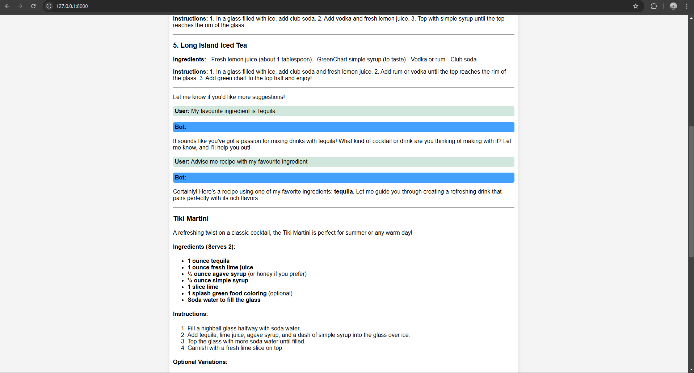
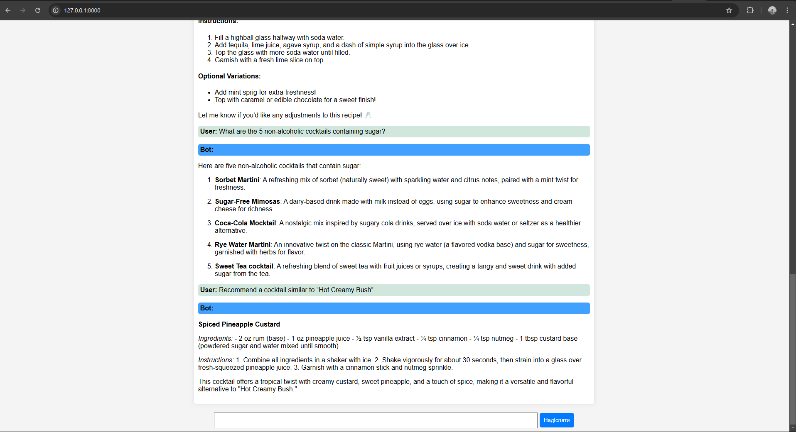

# Cocktail Advisor Chat🍸
___

I developed a Cocktail Advisor Chat that leverages Retrieval-Augmented Generation (RAG) to provide users with accurate and context-aware cocktail recommendations. By integrating RAG with a knowledge base, the chatbot can retrieve relevant cocktail recipes, ingredient substitutions, and mixology tips in real time. The chatbot has ability to provide personalized cocktail suggestions based on user preferences and available ingredients.

## Installation👾
___

Python3 must be already installed.

```shell
git clone https://github.com/Barsh4ec/PythonMLTestTask
python3 -m venv venv
source venv/bin/activate  # On Windows, use venv\Scripts\activate
pip install -r requirements.txt
fastapi dev chat.py
```
And open this link in your browser http://127.0.0.1:8000.

## Features⭐
___
✅ **Cocktail Recommendations** – Suggests cocktails based on user preferences and available ingredients.

✅ **Ingredient-Based Search** – Users can input ingredients they have, and the bot suggests matching cocktails.

✅ **Step-by-Step Recipes** – Provides detailed mixing instructions for each cocktail.

✅ **Substitutions & Alternatives** – Suggests ingredient swaps if something is missing.


## Demo🖥️
___




## Technologies⚙️
___
 **FastAPI**
 **ChromaDB**
 **Ollama**
 **Sentence-transformers**
 **Pandas**